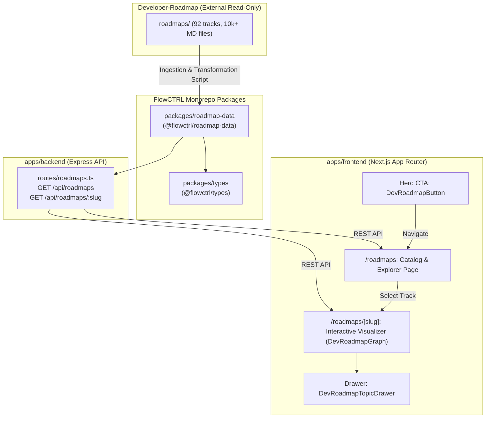

# Implementation Plan - Integration of Developer-Roadmap into FlowCTRL Monorepo

## Overview

Based on the [`deep-research-report.md`](file:///c:/Users/Dell/Downloads/overall/dev/obsidian/projects%20and%20it%27s%20code/flowCTRL/deep-research-report.md) and the external [`developer-roadmap`](file:///c:/Users/Dell/Downloads/overall/dev/obsidian/projects%20and%20it%27s%20code/additional%20used%20projects/developer-roadmap) repository (92 career/skill tracks and 10,000+ topic markdown files), we will build an end-to-end Developer Roadmap module for FlowCTRL.

The integration converts static markdown content into FlowCTRL's data layer, provides REST APIs in Express, and renders interactive, responsive graph/tree visualizations in Next.js with deep-dive topic drawers, learning resource links, and hero CTA integration.

---

## User Review Required

> [!IMPORTANT]
> **Data Processing & Scope:** The external repository contains 92 roadmaps with 10,499 topic files. We will ingest and bundle top core career roadmaps (Frontend, Backend, Full Stack, AI Engineer, Python, React, DevOps, Docker, Kubernetes, etc.) into `@flowctrl/roadmap-data` for lightning-fast build and API performance, alongside an automated ingestion pipeline capable of building any or all 92 tracks.

> [!NOTE]
> **Licensing & Attribution:** Per the research report, all roadmap content will include proper attribution and links to [roadmap.sh](https://roadmap.sh) for full educational compliance.

---

## Proposed Architecture & Changes

---

## Detailed File Modifications & Additions

### 1. Types & Data Models (`packages/types`)

#### [MODIFY] [`packages/types/index.ts`](file:///c:/Users/Dell/Downloads/overall/dev/obsidian/projects%20and%20it%27s%20code/flowCTRL/packages/types/index.ts)

- Add interfaces:
  - `RoadmapResource`: `{ id: string; type: 'article' | 'video' | 'course' | 'doc'; title: string; url: string; }`
  - `RoadmapTopic`: `{ id: string; slug: string; title: string; description: string; resources: RoadmapResource[]; children?: string[]; prerequisites?: string[]; category?: string; }`
  - `RoadmapNode`: `{ id: string; label: string; topicId: string; group?: string; level?: number; position?: { x: number; y: number }; }`
  - `RoadmapEdge`: `{ id: string; source: string; target: string; animated?: boolean; label?: string; }`
  - `RoadmapTrackSummary`: `{ slug: string; title: string; description: string; category: 'role' | 'skill' | 'best-practice'; topicCount: number; level: 'Beginner' | 'Intermediate' | 'Advanced'; iconName?: string; }`
  - `RoadmapDetail`: `RoadmapTrackSummary & { nodes: RoadmapNode[]; edges: RoadmapEdge[]; topics: Record<string, RoadmapTopic>; }`

---

### 2. Ingestion & Structured Data Package (`packages/roadmap-data`)

#### [NEW] `packages/roadmap-data/package.json`

- Package definition `@flowctrl/roadmap-data` with exports for bundled JSON roadmaps and typed query helpers.

#### [NEW] `packages/roadmap-data/src/ingest.ts`

- Script to scan markdown files from `developer-roadmap/roadmaps`, parse `# Title`, description body, and `@article@`, `@video@`, `@course@` resources into clean JSON data structures with graph nodes/edges.

#### [NEW] `packages/roadmap-data/src/index.ts`

- Data accessor functions: `getRoadmapsSummary()`, `getRoadmapBySlug(slug)`, `getTopicDetail(slug, topicId)`, `searchRoadmaps(query)`.

#### [NEW] `packages/roadmap-data/data/*.json`

- Pre-compiled JSON datasets for high-demand tracks (Frontend, Backend, AI Engineer, Full Stack, React, Python, DevOps, Docker, Kubernetes, etc.).

---

### 3. Backend API Service (`apps/backend`)

#### [NEW] `apps/backend/src/routes/roadmaps.ts`

- Express router implementing:
  - `GET /api/roadmaps`: Returns list of all available roadmaps with category, stats, description.
  - `GET /api/roadmaps/:slug`: Returns full graph data (nodes, edges, topics, resources) for a specific track.
  - `GET /api/roadmaps/:slug/topics/:topicId`: Returns individual topic data.

#### [MODIFY] [`apps/backend/src/index.ts`](file:///c:/Users/Dell/Downloads/overall/dev/obsidian/projects%20and%20it%27s%20code/flowCTRL/apps/backend/src/index.ts)

- Mount `/api/roadmaps` router.

#### [NEW] `apps/backend/src/routes/roadmaps.test.ts`

- Node.js test suite verifying API response codes, JSON schemas, 404 handling, and topic retrieval.

---

### 4. Frontend Application (`apps/frontend`)

#### [NEW] `apps/frontend/src/components/roadmap/DevRoadmapButton.tsx`

- Sleek hero CTA button with gradient glow, icon, and hover micro-animations linking to `/roadmaps`.

#### [MODIFY] [`apps/frontend/src/app/page.tsx`](file:///c:/Users/Dell/Downloads/overall/dev/obsidian/projects%20and%20it%27s%20code/flowCTRL/apps/frontend/src/app/page.tsx)

- Integrate `DevRoadmapButton` directly in the Hero CTA button group and add a Roadmaps navigation link in the top navbar.

#### [NEW] `apps/frontend/src/components/roadmap/DevRoadmapCard.tsx`

- Glassmorphism roadmap track card with category tags, topic counter, difficulty badges, and animated progress preview.

#### [NEW] `apps/frontend/src/components/roadmap/DevRoadmapGraph.tsx`

- Interactive visualizer supporting Canvas & SVG node rendering, hierarchical layout, smooth zooming/panning, node filtering by search or category, completion status checkboxes, and direct node click triggers.

#### [NEW] `apps/frontend/src/components/roadmap/DevRoadmapTopicDrawer.tsx`

- Interactive slide-over drawer displaying topic overview, learning resources with clickable external links, difficulty indicator, and completion state.

#### [NEW] `apps/frontend/src/app/roadmaps/page.tsx`

- Next.js Catalog page with track category tabs (All, Roles, AI & ML, Skills, Cloud/DevOps), search bar, and grid of roadmap cards.

#### [NEW] `apps/frontend/src/app/roadmaps/[slug]/page.tsx`

- Next.js dynamic track visualizer page with back navigation, track progress bar, toggle between Graph view and Outline/List view, and the interactive `DevRoadmapGraph`.

---

## Verification Plan

### Automated Verification

1. **Data Package Ingestion & Tests**:
   - Run ingestion script to parse and bundle roadmap datasets into JSON.
   - Run package tests ensuring all parsed roadmaps match TypeScript schema.
2. **Backend API Tests**:
   - Run `npm run test` in `apps/backend` to verify `GET /api/roadmaps` and `GET /api/roadmaps/:slug` endpoints.
3. **Monorepo Lint & Typecheck**:
   - Run `npm run lint` across all packages.
   - Run `npm run prettier:check` to ensure code formatting.
   - Run `npm run build` to verify Next.js static generation and App Router compilation without errors.

### Manual Verification

1. Verify Hero section on `http://localhost:3000` has the new **Dev Roadmaps** CTA button.
2. Navigate to `http://localhost:3000/roadmaps` and verify track cards, search, and category filtering.
3. Click on a roadmap track (e.g. `/roadmaps/ai-engineer` or `/roadmaps/frontend`) to test interactive graph panning, zooming, clicking nodes, viewing topic drawer with resources, and toggling completion.
